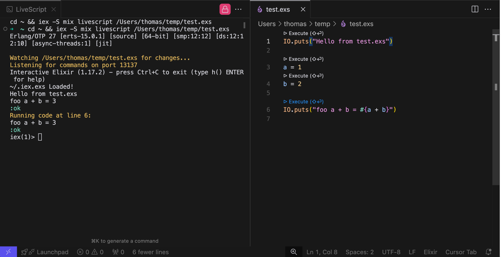
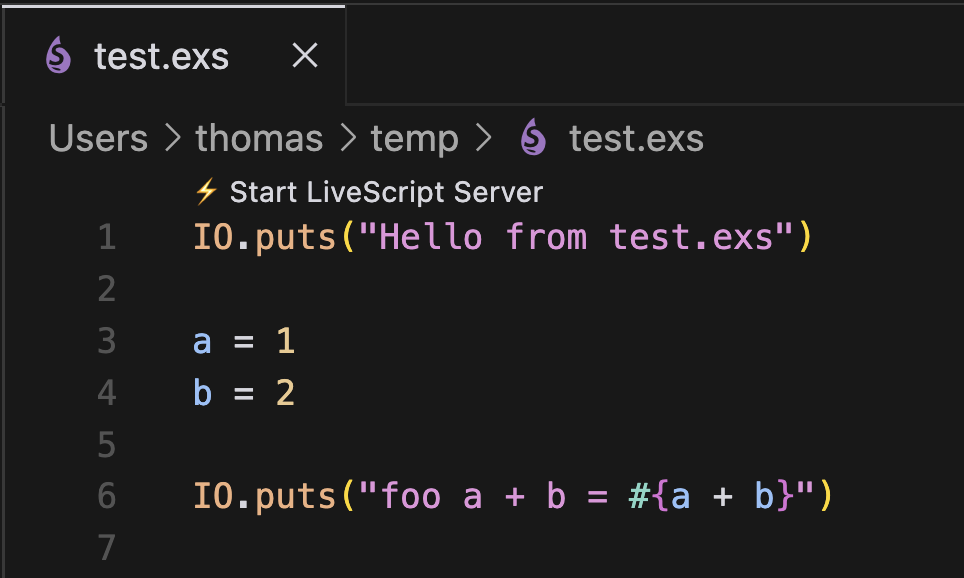

# VSCode LiveScript Extension

A Visual Studio Code extension that enables live execution of Elixir scripts with real-time feedback.
This extension allows you to run Elixir code blocks interactively within your editor, making development and experimentation more efficient.
For more information about LiveScript, see the [LiveScript README](https://github.com/thmsmlr/livescript).

## Features

- **Live Code Execution**: Run Elixir code blocks directly from your editor
- **Real-Time Feedback**: See results immediately in the integrated terminal
- **Interactive CodeLens**: Click-to-execute buttons appear above each executable code block
- **AutoRun on Save**: The LiveScript server will automatically detect changes to the file and execute only the new code (and it's dependencies)

## Requirements

- Visual Studio Code v1.60.0 or higher
- Elixir v1.17+ with OTP 27+

## Installation

1. Install the extension from the VSCode marketplace
2. Install the Livescript mix archive (see [LiveScript README](https://github.com/thmsmlr/livescript#installation))

## Usage

### Starting the Server

1. Open an Elixir script file (`.exs`)
2. Click the "⚡ Start LiveScript Server" CodeLens at the top of the file
   - Or use the command palette: `LiveScript: Start Server`

### Executing Code

There are several ways to execute code:

1. **Using CodeLens**
   - Click the `▷ Execute (⇧⏎)` button that appears above each code block

2. **Using Keyboard Shortcuts**
   - `Ctrl + Enter`: Execute the code block at the current cursor position
   - `Shift + Enter`: Execute the code block at the current cursor position and move to the next expression
   - `Ctrl + Shift + Enter`: Execute all code after the current cursor position

3. **Save the file**
   - The LiveScript server will automatically detect changes to the file and execute only the new code (and it's dependencies)

## Known Issues

- Server must be manually restarted if the Elixir file is renamed or moved

## Contributing

Contributions are welcome! Please feel free to submit a Pull Request.

## License

[MIT License](LICENSE)

